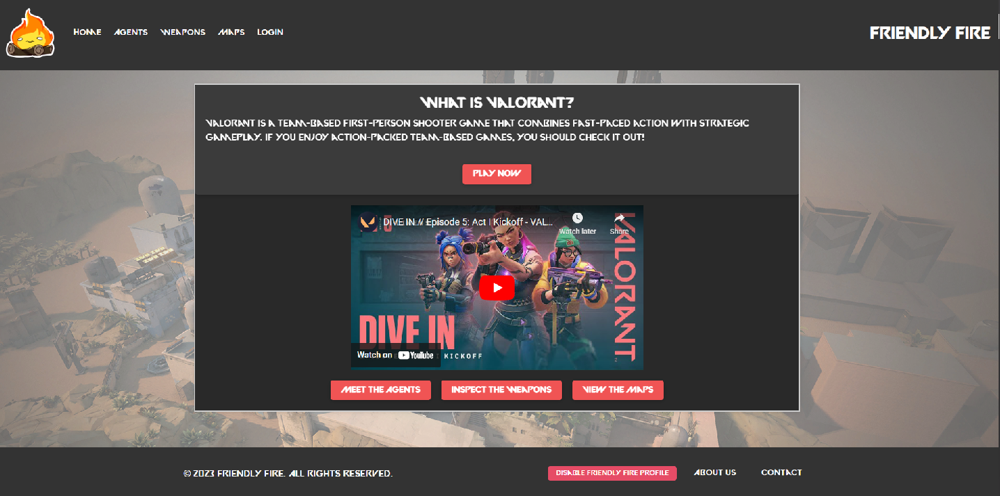

# Project Friendly Fire

## Description

Project Friendly Fire is a webpage that utilizes a custom RESTful API along with a Valorant API. This gives the user a place to track their stats alongside fellow users of the webpage.

## Table of Contents (Optional)

- [Installation](#installation)
- [Usage](#usage)
- [Credits](#credits)
- [License](#license)
- [Features](#features)

## Installation

If you wish to install this webpage to your own local machine, simply clone this repository to your local machine and run npm install in your terminal.

A screenshot of our homepage:

## Usage

To use this webpage follow the link provided!

[Webpage Link](https://project-friendly-fire.herokuapp.com/)

## Credits

Fellow collaborators on this project:

- https://github.com/akaydia
- https://github.com/PoochMagunder

## License

Refer to the LICENSE in the repo.

## Features

Creation of a profile to add your Valorant ID and create a bio, as well as view all the Weapons, Agents & Maps in Valorant!